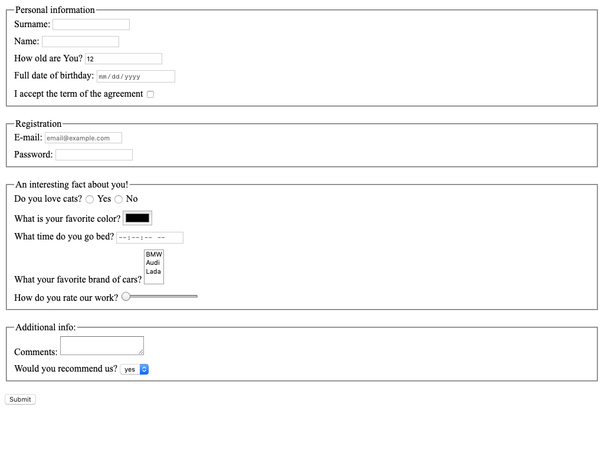

# HTML form
Replace `<your_account>` with your Github username and copy the links to Pull Request description:
- [DEMO LINK](https://<your_account>.github.io/layout_html-form/)
- [TEST REPORT LINK](https://<your_account>.github.io/layout_html-form/report/html_report/)

> Follow [this instructions](https://github.com/mate-academy/layout_task-guideline#how-to-solve-the-layout-tasks-on-github)
___

## The task:
Create HTML page with form. On form submit send form data to `https://mate-academy-form-lesson.herokuapp.com/create-application`

## Notes
- Every field should have name attribute
- Every field should have label, which focuses input on label click
  - Please add `for` attribute for each <label> and `id` to the field (it is important for tests)
- Do not use tabs. Use 2 spaces for indentation
- Most of the time you want each tag in new line
- Form should have different inputs with such types:
  - [ ] text
  - [ ] number
  - [ ] email
  - [ ] checkbox
  - [ ] radio
  - [ ] password
  - [ ] range
  - [ ] time
  - [ ] color
  - [ ] date
- Form should have textarea and select elements.
- You should use every of this attribute at least one time
  - [ ] required
  - [ ] min
  - [ ] max
  - [ ] minlength
  - [ ] maxlength
  - [ ] multiple
- The number field should have default value: `12` and maximum value 100.
- The email field should have placeholder value: `email@example.com`.
- The text fields should have disabled autocomplete.
- Add a button which submits the form.
- Add `onsubmit="onSubmit()"` attribute to `form` tag to show form value on submit
- Vertical distance between inputs should be `10px`
- Vertical distance between blocks with inputs should be `20px`
- Any other styles should be browser default

## Tips
- You can group different input sections with [fieldset](https://developer.mozilla.org/en-US/docs/Web/HTML/Element/fieldset) tag
