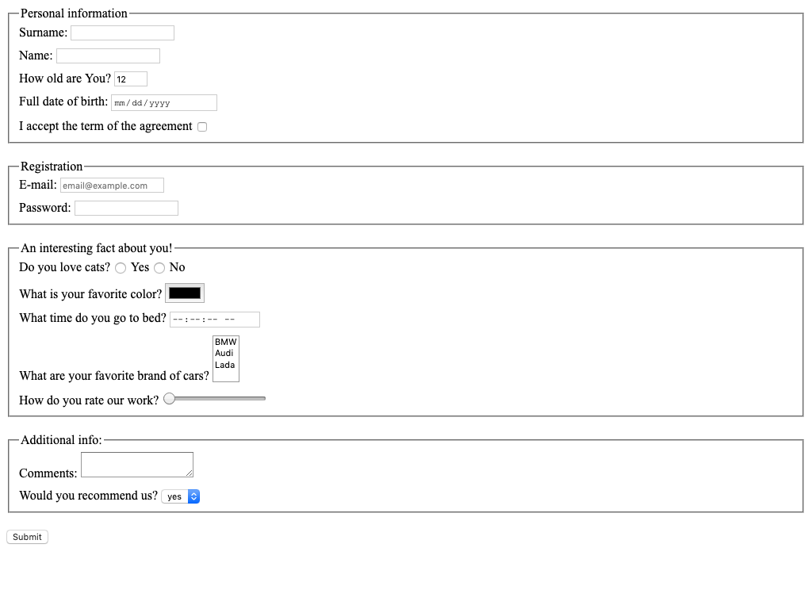

# Frontend practice with html forms

## Main goal:
Create HTML page with form. On form submit send form data to 
`https://mate-academy-form-lesson.herokuapp.com/create-application`

Screenshot of this form:

## Common mistakes
* Every field should have name attribute
* Every field should have label, which focuses input on label click
* Do not use tabs. Use 2 spaces for indentation
* Most of the time you want each tag in new line

## Requirements:

Form should have different inputs with such types:
  - text
  - number
  - email
  - checkbox
  - radio
  - password
  - range
  - time
  - color
  - date

Also form should have textarea and select elements.
  
Every field should have label which focus the input by click. See reference 
[screenshot](./references/form-example.png) for label names.
Every field should have name attribute.
  
- You should use every of this attribute at least one time - required, min, max, 
minlength, maxlength, etc
- The number field should have default value: '12'. Add attribute 
`data-qa="field-value"` to test it correctly.
- The email field should have placeholder value: 'email@example.com'.
Add attribute `data-qa="field-placeholder"` to test it correctly.
- The text fields should have disabled autocomplete.
- Add a button which submits the form.
- Vertical distance between inputs should be 10px
- Vertical distance between blocks with inputs should be 20px
- Any other styles should be browser's default

---
**Read the guideline before start**

[Guideline](https://github.com/mate-academy/layout_task-guideline/blob/master/README.md)

**Result**

- [UPDATE DEMO LINK](https://<your_account>.github.io/<repo_name>/)
- [UPDATE TEST REPORT LINK](https://<your_account>.github.io/<repo_name>/report/html_report/)
